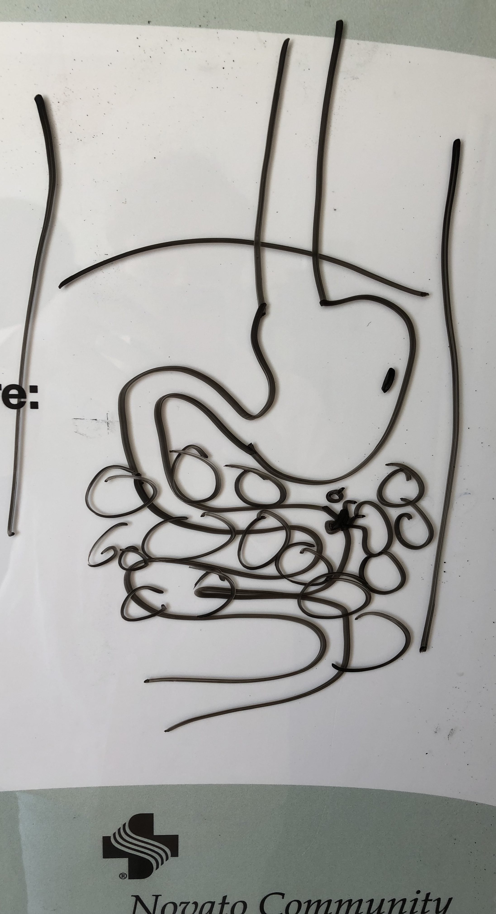
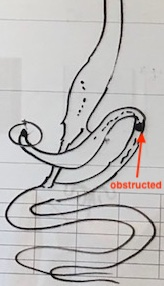

### A Journey Through and Beyond Lymphoma

* [Turning Senior](#june-2021-turning-senior)
* [Diagnosis](#july-2021-diagnosis)
* [Chemo Treatment](#august-2021-chemo-treatment)
* [Enforced Retreat](#enforced-retreat)
* [Recovery, Readmission](#september-2021-recovery-readmission)
* [Discharge, Obstruction, Readmission](#october-2021-discharge-obstruction-readmission)
* [Tube Feeding](#november-2021-tube-feeding)
* [Final Chemo](#december-2021-final-chemo)
* [Restaging](#january-2022-restaging-scan)
* [Remission, Normalcy](#february-2022-remission-return-to-normalcy)
* [Tube Removal](#march-2022-tube-removal)
* [Return to Work and Life](#april-2022-return-to-work)
* [Afterward](#afterward)

### June 2021, Turning Senior

On 06-02, I turned 65.
In preparation for this event, I'd already registered for [Medicare][medicare].
This was required in order to be _fully enrolled_ in Parts A and B.

> Subsequently, it turned out this was a **really good thing**. The timing turned out to be impeccable.
> Even though I was also covered by [Aetna][aetna], it was good to have Medicare as my secondary insurer.
> I recommend you be doubly ensured when possible, esp. at 65 with Medicare.

During the weeks leading up to 07-04, I was experiencing some constipation.
So, I was taking [MiraLax][mira-lax] with some regularity to help with the bowel movements.
My stools were dark, really dark, which was _not_ normal.
In hindsight, this was likely indicative of some _bleeding_ in my upper GI tract.

### July 2021, Diagnosis

On 07-03, I happened to be massaging my abdomen, especially the area of the colon to help its [peristalsis][peristalsis].
As I was massaging the area on the left side of my abdomen, I suddenly encountered what felt like a solid mass.
The mass felt about the _**size of my fist**_.
Alarmed, I immediately revealed this discovery to my wife Brady.

On 07-04, we went over to the Urgent Care facility in Hamilton to discuss my discovery with a nurse.
The nurse told us they had no way to help, and recommended we head over to the Emergency Room.

On 07-05, we headed over to [Sutter Health Emergency Room][sutter-novato] in Novato, and got checked in.
During the check-in, I reported my symptoms and discovery of the mass in my abdomen.

The male intake nurse patiently listened to my report and captured the information I provided.
He appeared rather blasé up until the point where he felt and palpated my abdomen himself,
at which point his eyes suddenly went wide, as he could also clearly feel the mass.

Thereafter, I was quickly admitted and taken to one of the hospital rooms.
A little while later, they took me over to the Radiology department for a scan.
They did a CT scan of my abdomen and confirmed what I had discovered: I got a preliminary diagnosis of
[lymphoma][lymphoma], multiple clusters scattered throughout the abdomen.

The attending physician [Dr. Singh][dr-singh] drew a cartoon sketch on the whiteboard in the hospital room.
He told us that he trained as an oncologist, though he was not board certified.
He warned us that the main tumor was in a _bad place_, and that extra care might need be taken for any subsequent treatment.
They kept me overnight.

On 07-06, a needle biopsy of the main tumor mass was taken.
Four samples of the tissue were extracted from the main tumor for further analysis.

On 07-07, I was discharged from Sutter Hospital, and told the pathology report would follow.

On 07-08, we met with Dr. Mary Fabi my Primary Care Physician (PCP), and on the basis of the CT scan and initial
diagnosis got a general (ambulatory) referral to Oncology.

In the following days, Brady and I discussed where I should go for treatment.
Our primary choices were between UCSF and Stanford.
After some research and discussions, we settled on UCSF, and Brady started the process of getting me into UCSF to
see the lead oncologist there: [Dr. Lawrence Kaplan][dr-kaplan].
We also briefly considered [Marin Cancer Care][marin-cancer] (MCC) in Greenbrae, largely due to its proximity to my
PCP Dr. Fabi.
MCC is directly across the street from her office.

> The whole process of getting me into UCSF turned out to be rather arduous and more difficult than it should.
> Firstly, don't get sick. Secondly, if you do get sick, have someone with you, someone who cares for you deeply
and who will serve as your advocate. The medical world is a team sport, and you need someone on _your side_.

On 07-15, we visited with Dr. Fabi again.
Brady was frustrated. The pathology report was still missing.
And, Dr. Fabi had not received it yet either.
So, there was not much more she had to offer.

> I did get a pneumonia vaccination from Dr. Fabi, which it later turned out was _useless_ because the chemo
regimen I subsequently underwent _wiped out its effectiveness_.
> Who knew? Luck of the draw I guess. :P 
> These kind of things don't instill great confidence in [allopathic medicine][allopath] nor its practitioners.
> That said, depending on the matter to be addressed, the alternatives are not that great either.

After we left, Brady had to chase down the path report remotely.
She called Sutter Hospital in Novato repeatedly and spoke with various people there.
Eventually, she managed to get one of their staff to locate the pathology report, sitting on a table, waiting to be faxed.
Brady finally got the hospital staff member to fax the pathology report over to Dr. Fabi.

We immediately went over to Dr. Fabi's office.
It was now late in the day after Dr. Fabi had left.
After some wrangling with her staff, we finally managed to get a copy of the report.
After getting a copy of the report, we took it over to MCC across the street and applied to get into their cancer program.
Even though they were not our preferred treatment center, we felt we needed to get _**something**_ started quickly,
perhaps in parallel while we continued work on getting into UCSF.

Upon review of the [pathology report][path-report], we discovered that I was diagnosed with
[large B-cell non-Hodgkin's lymphoma][dlbcl].

* PRELIMINARY UPDATE by Dr. M. Patino on 7/10/2021, pending [FISH][fish-test], repeat CD10 and cMyc IHC.
* Diagnosis of large B-cell lymphoma has been established, but FISH will define diffuse large B vs  
high grade B-cell lymphoma.

It turned out that the pathology analysis was done on 07-10 with those samples that were taken on 07-06.
Back on 07-11, the final pathology report was written up.
And then, it sat on a desk for _**four more days**_ until Brady managed to get the Sutter hospital staff to take notice
and fax it over to Dr. Fabi, so that we could then get a copy.

> Lessons: Be an active participant.
> Ask questions, do your homework, _learn_ what you need to know about your own body, disease, and treatment.
> Follow up. _Don't be passive_. Get what you need from everyone on your team.
> Until proven otherwise, assume that **_everyone_ is on your team**.

After applying to the MCC, Brady continued to work on getting me into UCSF.
We applied to their clinic, and submitted the pathology report.
We finally got an appointment with Dr. Kaplan scheduled for 08-02.

On 07-29, in preparation for the UCSF visit with Dr. Kaplan, I went to UCSF China Basin for a PET/CT scan.

### August 2021, Chemo Treatment

On 08-02, we went to the clinic at UCSF and met with Dr. Kaplan for the first time.
After our meeting, I was admitted to the hospital the same day and scheduled to start chemotherapy the following day.
A dual lumen [PICC line][picc-line] was inserted into my left upper arm, so that I could receive the chemotherapy drugs.

On **08-03 through 08-07**, I was given chemotherapy called [DA-EPOCH-R][da-epoch], dose-adjusted EPOCH-R, which includes:

<table>
<tr><th colspan="3"> EPOCH-R Drugs </th></tr>
<tr>
<td style="vertical-align:top">

* [Etoposide][etoposide]
* [Prednisone][prednisone]

</td>
<td style="vertical-align:top">

* [Oncovin][oncovin]
* [Cyclophosphamide][cytoxan]

</td>
<td style="vertical-align:top">

* [Hydroxydaunorubicin][doxo]
* [Rituximab][rituximab]

</td></tr>
</table>

This "cocktail" was administered over a 24 hour period on each day of 08-03 thru 08-07, so 5 days straight.
By the end of my many days of chemo, my left arm had a small clot and [DVT][dvt], which made it useless for
any more medical interventions: no more IVs, no more blood pressure cuffs, _**nada**_. 
At least, until the DVT was resolved mid-[November](#november-2021-tube-feeding).

On 08-08, I was discharged from UCSF, and on 08-09, I had a follow up video visit with Dr. Kaplan,
and also worked a full day for [Gensler][gensler], my employer.

On 08-10, Brady and I went back to the clinic at UCSF.
I needed to get a [Neulasta][neulasta] injection, and I also needed to schedule my next round of chemotherapy.
I got the injection in the clinic's infusion room.

> I distinctly remember receiving the injection in my abdomen on the left side, probably close to where the
tumor mass was originally detected.

I then returned to the clinic waiting room.
I felt a little "strange" after the injection, but wandered over to the entrance and sat down in front of one
the guys who do intake and scheduling.
I told him that I needed to schedule my next round of chemo, and suddenly felt lightheaded.
I told him about my symptoms, and _**then fainted**_.

> It was a good thing I was sitting down.
I was out for about 40 seconds before I was roused back to consciousness.

Brady was standing next to me, yelling at people to get their attention.
I was put into a wheelchair, and taken back into the infusion room, and put into one of the hospital beds.
I started to be surrounded by nurses and doctors.
Emergency medical staff started to show up.

I started _projectile **VOMITING BLOOD**_.
After I filled a few (4-5?) vomit bags with blood, I stopped and seemed to stabilize for a while, enough to get moved over to
the Emergency Room across the street.

> I was in shock. Brady was in shock, traumatized, still functional, mad as hell, kicking ass as only she can.

I was moved from the bed in the clinic into a wheelchair to be moved to the ER across the street.
When we got down to the street level, the EMTs wanted to load me into an ambulance.

> Brady and I both agreed _**that was nuts**_, and refused, because the ER was directly across the street!
I actually had to _sign paperwork_ electronically in order to _dismiss the ambulance_.

A pair of guys finally agreed to help walk me over in the wheelchair.
So, that's what we did.

> Note: You **don't** have to agree to unreasonable procedures just because some _official_ person has a fucking protocol.

Once we were in the ER waiting room, it took only a little while longer to get admitted.
After I was given a place in the ER, I was evaluated, given a CT scan, and then taken to
[Interventional Radiology][inter-rad] IR, where they were able to stop the [internal bleeding][upper-gi-bleed].
They [embolized][embolize] the area that was bleeding.

From the MD notes about the CT scan:

1. Compared to 7/5/2021, similar size of large left mid abdominal/mesenteric mass
which appears eroded into and fistulized with the distal duodenum/proximal jejunum.
Unchanged size of extensive mesenteric/retroperitoneal lymph nodes, which appears
centrally necrotic, compatible with interval treatment. Numerous new splenic lesions,
compatible with worsening splenic disease involvement.
2. Multiple foci of active arterial extravasation into this mass, may reflect a source of
hematemesis, with extensive intrinsic hyperdensity distending the gastric and duodenal
lumen, likely also blood product.
3. Marked fluid distention of the stomach and proximal duodenum, to the level of the mass,
suspicious for obstruction.

From the IR notes about the procedure:

* There were 2 pseudoaneurysms arising from the left colic artery.
* Left colic artery was embolized to stasis using Concerto microcoils and 300-500 micron Embospheres.

It turned out as Dr. Singh [observed](#july-2021-diagnosis), the main tumor _was indeed_ in a bad place, 
a **really** _bad place_.
And, the chemotherapy was effective, _very effective_.
The tumor was resting against the small intestines, near where the [duodenum meets the jenunum][duodenum].

And so, as the _tumor shrank_, it pulled away from the small bowel and _**left holes**_ behind.
Also, the whole area was close by the main artery in the abdomen, the blood supply for many of the nearby organs,
and as it happened, _for the tumor_.

> Frankly, **I got lucky**. If I'd been anywhere else other than the clinic at UCSF, _I would have died_.
> As it was, I was traumatized. Brady was traumatized.

After IR completed the embolization, I was unconscious from the anaesthesia.
I awoke intubated, trussed up, and tied down.

> It was a _very disturbing experience_.
> I couldn't move and I could _barely breathe_.
> Not recommended for _any_ duration, even when you're _not_ claustrophobic.
> Oh and by the way, I'm certainly _not_.
> I've had extensive experience with [isolation tanks][samadhi] and sensory deprivation.
> This experience was of another kind.

From the MD notes in Emergency:

* Pt is bleeding from the lymphadenopathy/large mass that was commented on the CT causing duodenal/jejunal bleed seen on CTA.
* Continued to have large amounts of blood from NGT with hgb drop overnight, went back to IR overnight.
* On levo (relatively stable since 3AM), BUN 42, Cre 1.1, lacate 2.5, requiring in total 16 units pRBC, 2 plts, 7 FFP, 2 cryo.
* IR embolized left colic artery, proximal to the coil/PVA embolization initially, IPDA branch on 2nd look.
* At this time, with HDS and visualized active extrav that they were able to stop with IR,
* I suspect the culprit artery has been intervened upon and active bleeding has subsided at this time.
* Given likely complicated erosions in distal duodenum/jejunum, IR intervention would be most appropriate initially.

As I've later been told, I received **10 liters** of blood/hemoglobin, which is **double** what a human body normally contains.
As noted above, I received 16 units of hemoglobin [pRBC][prbc-blood] in the ER as a result of the
[upper GI bleed][upper-gi-bleed].
An adult body normally contains about [10 units][body-blood] of blood.

And, that was just the initial round of transfusions that were required to stabilize me and get me through
the embolization to stop the bleed.
During the following days while in ICU, I received additional hemoglobin transfusions.

Excerpted from the MD notes in IR collected 08-10 2103 (via ICU notes):

* Selective catheterization: Superior mesenteric artery, C2 catheter 
Findings: Normal-appearing artery and branches without stenosis, dissection, or
abrupt occlusion. Questionable abnormal vessels arising from a jejunal branch.
* Superselective catheterization: Jejunal branch of the superior mesenteric artery. 
Findings: Normal-appearing artery and branches without stenosis, dissection, or
abrupt occlusion. No active bleeding or signs to suggest recent bleeding.
* Selective catheterization: Inferior mesenteric artery, Sos catheter 
Findings: Normal-appearing artery and branches without stenosis, dissection, or
abrupt occlusion.  No active bleeding or signs to suggest recent bleeding.
* Selective catheterization: Inferior mesenteric artery 
Findings: 2 small pseudoaneurysms arising from the left colic artery.
* Embolization: Catheter position for embolization: Left colic artery
    - Embolic(s): 3 mm to 4mm Concerto coils across the pseudoaneurysms, 
followed by 300-500 PVA particles, followed by 5mm Concerto coils.
    - Angiographic endpoint: Complete stasis (static contrast column for at least 5 heartbeats).
* Completion angiography:
Vessel catheterized: Left colic artery, proximal to the coil/PVA embolization. 
Findings: No filling of arborized blood vessels in the region of the erosive
large lymph node mass, nor the pseudoaneurysms. Static contrast noted in the
area which likely represents extravasated intraluminal contrast.

Excerpted from the MD notes in IR collected 08-11 0534 (via ICU notes):

* Selective catheterization: Celiac artery, 
Findings: Normal-appearing artery and branches without stenosis, dissection, or
abrupt occlusion. No active bleeding or signs to suggest recent bleeding.
* Selective catheterization: GDA, 
Findings: Normal-appearing GDA without stenosis, dissection, or abrupt occlusion.
Two areas of active extravasation superimposed on a background of arterial irregularity involving
multiple terminal branches of the superior pancreaticoduodenal artery.
Pooling of contrast into the lumen of the regional small bowel.
* Selective catheterization: Superior mesenteric artery, 
Findings: Normal-appearing artery and branches without stenosis, dissection, or
abrupt occlusion. 
No active bleeding or signs to suggest recent bleeding. 
Post-embolization runs do not show any sites of active extravasation or
arterial irregularity.
* Embolization:
Catheter position for embolization: IPDA branch
    - Embolic(s): Onyx
    - Angiographic endpoint: Complete stasis (static contrast column for at least 5 heartbeats)
* Completion angiography:
Vessel catheterized: GDA, SMA 
Findings: Complete cessation of active bleeding. No evidence of retrograde
filling via collateral vessels.
* Impression:
GDA angiogram demonstrates two areas of active extravasation superimposed
on a background of arterial irregularity involving multiple terminal branches
of the superior pancreaticoduodenal artery, correlating with the CTA findings.
Successful Onyx embolization to stasis. Recommend monitoring for signs of
possible small bowel ischemia given territorial extent of embolization.

As noted above, IR embolized the [LCA][left-colic] with [Concerto coils][concerto] and
[Embospheres][embo-spheres] (the [PVA particles][pva-part]), and then they embolized the
[IPDA][ipd-artery] branch of [SMA][sm-artery] with [Onyx][onyx].
So, to fully stop the GI bleed required two separate procedures in two distinct places
within the abdominal cavity surrounding the small bowel near where the duodenum meets the jejunum.

Altogether, I was in the ICU from 08-10 through 08-16, then migrated to Acute Care on 08-16, and
remained there until discharge on 09-09.

> In ICU, I was week as a kitten. Even though only a week had passed, I lost significant muscle mass and dexterity.
> Once able to move, under PT guidance, it took some few days to regain enough strength to move to Acute Care.

On 08-16, I had another CT scan, with excerpts from the MD notes:

1. Overall **decrease in size of the mid abdominal/mesenteric mass with fistulization to
the distal duodenum and proximal jejunum with extraluminal oral contrast consistent with leak.**
2. Less distended proximal duodenum and stomach upstream to the mesenteric mass.
3. Progressively enhancing areas in the left aspect of the mesenteric mass likely represent
enhancing lymphoid tissue and less likely slow venous bleeding. Clinical correlation with
symptoms of active hemorrhage is recommended.
4. **Pulmonary emboli seen in the segmental and subsegmental arteries of the right lower lobe.
No right heart strain.**

On 08-17, Brady and I were told that _prognosis was **not good**_, predicated on the results of DA-EPOCH that led
to the bleed event on 08-10.
Regarding possible resection, as discussed with the lead surgeon [Dr. Kirkwood][dr-kirkwood]:

* Tx: ... **Surgical resection is not an option given involvement of tumor with SMA and mesentery.**
* Plan for bowel rest and chronic TPN to reduce bowel contamination in the event of a perforation.

Frankly, the oncologists were at a bit of a loss, unsure how to proceed.
On one hand, I needed to complete chemotherapy in order to eradicate the lymphoma.
On the other hand, I was clearly at high risk of another GI bleed if the DA-EPOCH regimen was continued.
So, that regimen was out of the question.
After some back and forth, and frank discussions between ourselves Brady and I, we asked whether there was any
approach that offered some kind of middle ground: something less intense than EPOCH that might still offer an
eventual hope of remission.

After further discussion among themselves, the oncology team led by Dr. Kaplan offered a regimen called
[mini-CHOP][mini-chop].
This regimen uses basically the same chemo drugs at lesser dosage with a two week frequency, that would
still work on an aggressive lymphoma such as mine.
Brady and I agreed that this was acceptable, and a better alternative to EPOCH or eventual death from leaving the
lymphoma untreated.

On 08-19, a new central dual-lumen [PICC line][picc-line] was placed in my chest by IR to support receiving further
chemotherapy with mini-CHOP.
On 08-20, I received the first dose of mini-CHOP chemotherapy, with each subsequent round planned to be every two weeks.

<table>
<tr><th colspan="3"> R-CHOP Drugs </th></tr>
<tr>
<td style="vertical-align:top">

* [Cyclophosphamide][cytoxan]
* [Hydroxydaunorubicin][doxo]

</td>
<td style="vertical-align:top">

* [Oncovin][oncovin]
* [Prednisone][prednisone]

</td>
<td>

* [Rituximab][rituximab] monthly

</td></tr>
</table>

On 08-31, I had another CT scan, with the following excerpts from MD notes:

* Redemonstrated postoperative appearance from superior pancreaticoduodenal and left colic artery embolizations.
* Interval decrease in size of mid abdominal mesenteric mass, associated mesenteric lymphadenopathy, and
splenic metastases, compatible with treatment effect.
* No new disease

### Enforced Retreat

Little did I know at the time that I was on a kind of _enforced retreat_.
In years past, I participated in various practices that now came to the fore: meditation, chanting, prayer.
I started writing, including this missive.

News of my diagnosis and treatment had made the rounds among family and friends.
It turns out, I had a **large** number of _people praying for me_.
I not only heard about this from friends and family who participated, I also could _feel this_.
There was a palpable feeling of ambient love that surrounded me, especially while in hospital at UCSF.

I could also feel the Presence of my Guru: Adi Da Samraj.
A blessing Puja was done on my behalf, performed by the priests at [Adi Da Samrajashram][ashram],
Bhagavan Adi Da's main hermitage sanctuary.

His Embrace was also felt in my room at the hospital, deeply bestowed, Lit beyond words.
His Radiance surrounded me whole bodily, and felt like a kind of _second skin_.

I was struck by how available was his blessing.
I've been his devotee for decades, and even though he passed in 2008 and I'd lapsed into minimal practice, 
his Presence was there, immediately available and Radiant.
No distance, no difference, simply Present.
All I had to do was turn to him and feel his Presence.
His obvious loving regard made me weep.

### September 2021, Recovery, Readmission

On 09-03, I received another round of chemo mini-CHOP. 
On 09-09, I was **discharged** from Acute Cute, having recovered enough strength and mobility.

> While in Acute Care, I exercised daily. I knew what would be required of me to regain the strength needed to exit.
> Fortunately, I had practiced [Aikido][aikido] in past years, and I had expectations of my body.
> I knew that of which it was capable. So, I stretched, walked, squatted, moved, _every day_.
> I took my pole for walks around the floor at 11-Long UCSF.
> I paused in my walking circuits and practiced [tenkan][tenkan], stretches, squats and wrist rolls.

On 09-17, I received another round of chemo mini-CHOP. 
On 09-27, I was **readmitted** to hospital, having had recent vomiting episodes.

### October 2021, Discharge, Obstruction, Readmission

On 10-01, I received another round of chemo mini-CHOP. 
On 10-04, I had a gastro-grafin trial, which showed slow but ultimate clearance of a contrast through the duodenal space
and out through the colon. So, I wasn't completely obstructed, but also clearly _not normal_.

My wife Brady prevailed on the oncology team: she wanted my treatment to progress quicker, to get my chemo done sooner.

On 10-08, my chemo schedule was changed. It was advanced, but only slightly, just by a few days. 
On 10-11, I received another round of chemo mini-CHOP.

Lessons from hospital:
* Never trust a fart. What feels like a fart will often turn out to be something more _substantial_.
* Any boredom that arises is of your own making. Change your _act_ to change your attitude.
* Keep your wits and humor about you. Don't allow circumstance to rob you of your heart.
* No matter how bad it seems, likely someone else there is worse off than you. That may be your roommate.
* Given the frequency with which nurses check on you, sleep as you can, when you can.
* We're all dying. Fight and live until you can't anymore.
* It's how you live that helps you meet death with some kind of presence and equanimity.

On 10-15, I had PET/CT scan with signs of tumor reduction to 20% of original size. 
On 10-19, I was **discharged** from hospital.

On 10-25, I was **readmitted** to hospital, having had recent vomiting episodes. 
On 10-26, I received another round of chemo mini-CHOP.

On 10-29, we met with the surgery team, with the following NP notes:
* Patient frustrated after team meeting with GenSurg and Malignant Hematology yesterday evening as the only
option he has right now is the GJ tube per his understanding, with _**surgery** as an option after chemotherapy_.

We were advised that I'd likely need to have _bypass surgery_ after my chemo was done.
One of the surgeons drew a simplified sketch of the proposed procedure result on the whiteboard in my room (at right).

I found a somewhat better diagram of this through [Research Gate][gastro-article] (below right).
The sketch shows that the stomach would be detached from the duodenum, and re-attached to the small bowel
below the point at which it was obstructed.

Apparently, this procedure is called a [gastrojejunostomy][gastro-jejuno].
We were informed that this was a _major surgery_ and would involve opening up my entire abdomen in order to
re-arrange my guts.
Naturally, I was _**extremely reluctant**_ to hear about this possibility.
I was NOT encouraged in the least about such a prospect.

> The healing of my small bowel became a focus of intention and whole body prayer for me.
> Day by day thereafter, the love that I felt in my room was channeled into the healing of that area.

Meanwhile, the GI team recommended that I have a [GJ-tube][feeding-tube] installed so that I could receive better nutrition than what
I'd been receiving via the TPN IV feeds.
I had a number of concerns about the proposed procedure.
The main one was: given I had a "high grade" obstruction, how likely was it that IR would be able to do it safely and succeed?

### November 2021, Tube Feeding

On 11-02, after due consideration with Brady, I had the [GJ-tube][feeding-tube] installed. From the IR notes:
* GJ placed with tip past [ligament of Trietz][treitz] as confirmed with contrast,
* retention balloon instilled with 8 mL sterile water.

Once again, it was the team in [Interventional Radiology][inter-rad] IR at UCSF Parnassus which installed the GJ-tube.
This time, I was awake during the procedure, and so got to see what they were doing.

> Arthur C. Clarke [quipped][magic]: "Any sufficiently advanced technology is indistinguishable from magic."
> [Interventional Radiology][inter-rad] IR performs such feats daily.
> They have the tools and tech to perform some very important small-scale **miracles**.

> While installing the tube, they were able to see inside me in real time _without surgery_.
> Because I was only lightly sedated, I could also see what they were seeing on the screen they used to observe the procedure.

On 11-03, I had my first tube feeding with [ISO Source][formula] formula.

During the ensuing days, I started feeling much better, getting much better nutrition and nourishment.
Once I started feeding by tube with ISO Source, the TPN IV feeds were stopped.

On 11-09, I received another round of chemo mini-CHOP. 
On 11-10, I was **discharged** from hospital. 
On 11-11, I returned to the clinic to receive [Neulasta][neulasta], as I'd not had that after the recent chemo.

I continued tube feeds for 12 hours every night at home.
The ISO Source was keeping me nourished, such that I felt no hunger pangs ever.
It was rather amusing: while receiving the formula, the most I ever felt for eating was a kind of _vague nostalgia_.

Watching other people eat was another kind of strange experience.
I got a vicarious thrill from their enjoyment of the food they ate.
I loved the fact that they were so filled and sated by their food and all of the rituals that arise around meals,
while not feeling any kind of craving for the food.
It was a kind of pure enjoyment, without all the fanfare and consequence of having to eat the food myself.

> Every now and then, I would smell some pungent food aromas, breathe them in deeply, and feel a wave of appreciation:
> Wow! It would be great to eat that meal once again.
> Then, the feeling would pass and evaporate along with the aromas.
> As if a ghost had just passed by, merely to haunt me _without hunger_ for a little while, only this afterthought of appetite.
> Like the afterimage that shows up briefly when you look at something suddenly bright and then look away,
> the retained image slowly dissolving over time.
> The _idea_ of hunger was like that, just a passing memory, almost but _not quite real_.

On 11-16, FU visit with labs, FU, and DVT eval = clot resolved!! My left arm was finally free of the [DVT](#august-2021-chemo-treatment). 
On 11-23, blood drawn + chemo = mini-CHOP, [Neulasta][neulasta], all in _Clinic_.

### December 2021, Final Chemo

Brady and I were living in San Francisco so that I we could remain close by USCF.

On 12-02, video visit with Dr. Kaplan. 
On 12-07, blood drawn + chemo = mini-CHOP, [Neulasta][neulasta], all in Clinic 
On 12-21, blood drawn + chemo = mini-CHOP, [Neulasta][neulasta], all in Clinic.

### January 2022, Restaging Scan

On 01-31, PET scan + CT scan with contrast.
This was the clincher, a final assay of my insides.
The PET scan would show whether I had any remaining cancerous cellular activity.
The CT scan with contrast would show whether I had any remaining obstruction in my small bowel.

### February 2022, Remission, Return to Normalcy

On 02-02, received report from PET/CT scan [analysis][pet-report]. From report,

FINDINGS:

* Decreased size of multiple left upper quadrant mesenteric masses **without associated hypermetabolism**. 
For example, one mass measures 3.0 x 1.9 cm, previously 3.5 x 2.3 cm (abdominal CT series 205, image 104).  
**No residual hypermetabolism**.
* Lymph nodes: Described above.
* Lungs: No metastases.
* Abdominal and pelvic organs: No metastases. Bones: No metastases.
* Other: No metastases.

Non-oncologic findings on diagnostic CT:
* Brain: Diagnostic CT of this region was not obtained.
* Neck: Diagnostic CT of this region was not obtained.
* Chest: LUNGS: A right lower lobe segmental pulmonary embolus is _no longer visualized_.
* PLEURA: Unremarkable.
* MEDIASTINUM: Unremarkable.
* HEART/GREAT VESSELS: Right chest port with tip in the right atrium.
* BONES/SOFT TISSUES: Unremarkable.
* Abdomen/Pelvis: Liver: Unremarkable
* Gallbladder: Unremarkable
* Spleen: 9.7 cm spleen.
* Pancreas: Unremarkable
* Adrenal Glands: Unremarkable
* Kidneys: Unremarkable
* GI Tract: Gastrojejunostomy tube in stomach with embolization material surrounding the stomach.  
_**No evidence of obstruction**_.
* Vasculature: Unremarkable Lymphadenopathy: Absent
* Peritoneum: No ascites

IMPRESSION:
1. Decreased size of predominantly abdominal lymphadenopathy, **none of which demonstrate**  
**hypermetabolism** above blood pool. Deauville score 2.
2. Gastrojejunostomy tube _**without evidence of obstruction**_.
3. For further detail on simultaneously acquired PET/CT, see separately dictated report.

On 02-03, met with [Dr. Kaplan][dr-kaplan] in person at UCSF for follow up on PET/CT scan.
He confirmed that the lymphoma is _**in remission**_, and that I'm done with chemotherapy.
He offered [EVUSHELD][evusheld] as a treatment to prevent COVID.
He referred me to [Dr. Kirkwood][dr-kirkwood], the head of surgery, for follow up discussion about
my (evidently former) bowel obstruction.

On 02-07, met with [Dr. Kirkwood][dr-kirkwood] by video chat to discuss the absence of any evidence of a bowel obstruction.
Brady was amazed that I had no sign of obstruction, given how I was diagnosed in hospital, when all indications were
that I would need major surgery to completely [bypass](#october-2021-discharge-obstruction-readmission) the duodenum.
While her heart was greatly relieved, the scientist in her was _frustrated_.
She wanted an explanation.

Dr. Kirkwood as much as indicated: these things happen.
Dr. Kirkwood agreed that my diet could advance, and that I should track its progress.
I started a diet diary to show the progress of my diet in the following days.

2022-02-07, Mon
* 02:00, end tube feed, flushed tube
* 05:00, coffee, creamer, yoghurt drink
* 08:00, oatmeal, multi-vitamin, acyclovir, D3
* 14:00, egg bites: white eggs w/peppers, 1/2 dose MiraLax
* 17:30, chicken skewer, veg noodle soup, beer
* 19:30, start tube feed, 720 ml

2022-02-08, Tue
* 02:30, end tube feed, flushed tube
* 05:00, coffee, creamer, yoghurt drink
* 06:30, oatmeal, trail mix
* 09:00, weight = 155.8 lbs
* 12:00, multi-vitamin, acyclovir, D3, cottage cheese
* 15:30, chicken skewer, cottage cheese
* 19:00, start tube feed, 720 ml

2022-02-09, Wed
* 01:30, end tube feed, flush tube
* 05:00, coffee, creamer, cookie, yakult
* 07:00, bowel movement
* 07:30, weight = 157.0 lbs
* 09:00, 2 eggs, hash browns, toast, 1/2 coffee
* 09:30, multi-vitamin, acyclovir, D3, glutamine
* 13:30, burrito supreme, some soda
* 18:00, clam chowder, a few Ritz crackers
* 19:00, start tube feed, 720 ml

2022-02-10, Thu
* 01:30, end tube feed, flush tube
* 05:00, coffee, creamer, yoghurt drink
* 08:00, weight = 159.0 lbs
* 08:30, cream of rice, trail mix, 1/2 banana
* 09:00, acyclovir, D3, multi-vit, glutamine
* 12:30, grilled cheese sandwich
* 14:30, ice cream
* 17:00, blood sugar = 132
* 17:30, stir fry w/chicken, veg, rice
* 18:00, start tube feed, 720 ml

2022-02-11, Fri
* 03:00, end tube feed, flush tube
* 05:00, coffee, creamer, yakult
* 06:45, weight = 159.8 lbs, blood sugar = 143
* 07:00, multi-vitamin, acyclovir, D3, eggs
* 09:00, 1/2 dose MiraLax
* 15:00, beef chili, beer: corona
* 18:00, 1 fried chicken strip, a few sweet potato fries
* 23:30, start tube feed, 720 ml

2022-02-12, Sat
* 05:00, coffee, creamer
* 05:30, end tube feed, flush tube
* 08:30, acyclovir, D3, multi-vit, glutamine, ginseng
* 08:30, instant oatmeal, banana, golden raisins
* 09:30, bowel movement
* 10:00, weight = 161.0 lbs
* 15:00, Pho soup w/beef brisket, bean sprouts, thai basil, beer: corona
* 17:00, blood sugar = 124

2022-02-13, Sun
* 05:00, coffee, creamer
* 08:30, weight = 160.8, blood sugar = 153, flush tube
* 09:00, acyclovir, D3, multi-vit, glutamine, ginseng
* 09:00, 1/4 baguette w/parmesan cheese
* 15:00, super bowl snacks: chips, dips
* 17:00, chicken strips, peanuts, beer: IPA x 2

2022-02-14, Mon
* 04:30, coffee, creamer
* 08:30, weight = 160.8, flush tube
* 09:00, 2 eggs, hash browns, grilled onions
* 09:00, acyclovir, D3, multi-vit, glutamine, ginseng
* 09:30, 1/2 dose MiraLax
* 13:00, left over Pho soup
* 17:00, grilled cheese w/sliced turkey, beer

On 02-15, Monica Becks from Dr. Kirkwood's staff reviewed my diet diary and agreed on the obvious progress.
Removal of the feeding tube was scheduled for 03-07 afternoon.
I also requested review of progress and that we schedule removal of the port from Dr. Kaplan's staff.

On 02-18, I received word from Heidi on Dr. Kaplan's staff that my port was scheduled to be removed on 03-10. 
On 02-23, I went back to 11-Long at UCSF Hospital.
I offered the staff there the remaining enteral supplies I had left over from my home tube feeds.
By policy, they could not take them.

I also told them just how much their care meant to me.
Their level of care made my hospital stay tolerable.
They kept me alive and capable for a long time: 3 months altogether over the course of a 4 month period.
Tran retired. God bless her, she was among those whose genuine care and conversations helped keep me sane.
Peter was there, as was Jennifer and a few others.
It was good to see some familiar faces, and let them know I was well and grateful.

### Gratitude

I'm grateful to all the RNs and NPs who helped me during my stays in hospital at UCSF, including
Katy, Aly, Ashley, Camille, Taylor, Madeline, Julia, Loren, Jenner, Naureen, Jeanne, Melissa, Kelsey,
**Wanda**, Derek, Brian, Anna, Kate, Aby, **Christine**, Whitney, Melody, Chloe, Megan, Karina, Beverly, Winnie.

I'm also grateful to the UCSF doctors who all kept their eyes on me, including Dr. Kaplan, Dr. Arora, Dr. Paddock,
Dr. **Cerejo**, Dr. Bahri, Dr. Zafar, Dr. Sayre, Dr. Jones, Dr. **Martin**, Dr. Logan, Dr. Kirkwood.

> These people made the otherwise intolerable tolerable.
> It also helped that I had the Arms of Practice and the arms of love in which to abide.
> Without them, my health and sanity would not have survived.

> All said and done, I'm healthier than I was before this whole journey started.
> I lost 40 lbs. I no longer had Diabetes, nor high blood pressure.
> I no longer needed Metformin, nor Lisinopril.
> I can't recommend the path it took to get here, though.
> It was traumatic, arduous, hazardous, and fraught with high risk.

I'm grateful to my family and friends who visited me while in hospital at UCSF, my wife Brady, my former wife Debbie, 
my daughter Ashley, my son Brendan, my brother Kevin, my fellow devotees Michel Winand, Ian Griffin, and all those who
participated in Pujas and prayers on my behalf, my mom, my sisters, my aunts and uncles, my nephews and nieces,
my wife's family the Richters and the Pullens, Alison, Scott, Leslie, Rob, Kendall, Duncan, Eva, Justin.

It's especially significant that this whole journey unfolded during the COVID pandemic.
UCSF imposed much greater restrictions on visitors during COVID.
Only one person was allowed to visit me each day while in hospital.
My wife Brady was with me nearly every day, except those where I had another visitor and she gave up her spot.

### March 2022, Tube Removal

On 03-07, Dr. Kirkwood removed the GJ-tube from my stomach, with Monica Becks attending.
This freed me from the aparatus that had been dangling on the front of my abdomen since its installation back on
[11-02](#november-2021-tube-feeding).

On 03-10, Dr. Amber Burke-Cravens removed the port from my right upper chest, along with Megan attending.
I again had the opportunity to express my gratitude for the help these professionals provided.

I also shared how much I was looking forward to the future: moving to Carlsbad, and returning to my home in Puerto Vallarta.
I explained a little bit how I survived the long stays in hospital, using the time as a kind of
[enforced retreat](#enforced-retreat).
I told them about having used [isolation tanks][samadhi] in my younger years, and having experience with meditation since
becoming a student and devotee of [Adi Da Samraj][ashram].

I described a particular insight that was revealed to me some years ago.
This human form has what I call a **binocular bias**.
The paralax perception of the eyes channels the brain to a **point of view** and focus.
The resulting conception in the brain channels the mind and activity toward egoity.
This effect is hardly ever noticed by most humans.
They are like fish in water, never noticing the medium in which they are embedded.
Even when noticed, this realization is not _useful_, not to the _ego_ anyway.

But, it does offer the possibility of a kind of liberation from the thrall of egoity that otherwise engulfs us all.
Such understanding and standing apart from these channels of psycho-physical form, thereby being free of the ego however
temporarily, one can cease one's otherwise ordinary activity, "step back" and see the Bigger Picture.
Oh, and then notice: there is _always_ a Bigger Picture.
And, it becomes possible to ask: what's important?

> In this moment, what's important?
> Or, as Adi Da would admonish us with his root enquiry: avoiding relationship?
> Moment to moment, the best answer is: be in relationship with What Is.
> Then, choose and act on the basis of that insight.
> The challenge is: What is the counter-egoic activity that best serves in _this_ moment?
> Then, do that. Otherwise, we fall back into egoity.
> Again, as Adi Da has observed: the Forces of Mediocrity working _for us_ far outweigh the Forces of Evil working against us.
> Then: are you going to do what you know, or merely go with the flow?

On 03-12, my wife Brady and I moved from San Francisco to our new home in Carlsbad California. 
On 03-29, I received approval from Dr. Kaplan for returning to work at Gensler on 04-18.

### April 2022, Return to Work

On 04-08, I got my COVID booster shot, having had some return of my immunoglobulin level. 
On 04-18, I returned to work at Gensler, 100% remotely while living in Carlsbad, CA.

### Afterward

The foundations of this missive were made possible by notes written by all those who served me in hospital at UCSF.
The notes were made available through [UCSF MyChart][my-chart] developed by [Epic][epic] Systems Corporation.
These notes provided lots of details about my care.

If you ever have have extensive care from medical professionals, I highly recommend you collect the notes they make.
You'll be amazed at what you discover regarding the care provided and the level of detail in the records kept. 
I was and still am amazed that I was able to write about this with the level of accuracy I've provided.
This was only made possible by virtue of the notes and some photos I took of the whiteboards in the rooms I stayed.

[medicare]: https://www.medicare.gov/
[aetna]: https://www.aetna.com/
[mira-lax]: https://en.wikipedia.org/wiki/Polyethylene_glycol#Medical_uses
[peristalsis]: https://en.wikipedia.org/wiki/Peristalsis#Large_intestine

[tumor-sketch]: images/tumor-sketch.jpg
[marin-cancer]: https://www.marincancercare.com/
[dr-singh]: https://www.healthcare6.com/physician/san-francisco-ca/nishith-singh-2118986.html
[lymphoma]: https://en.wikipedia.org/wiki/Non-Hodgkin_lymphoma
[sutter-novato]: https://www.sutterhealth.org/novato/find-location/facility/novato-community-hospital-emergency-department

[allopath]: https://en.wikipedia.org/wiki/Allopathic_medicine
[path-report]: pdfs/2021-07-15-Pathology.pdf
[pet-report]: pdfs/2022-02-02-PET-scan-results.pdf
[dr-kaplan]: https://cancer.ucsf.edu/people/kaplan.lawry
[dr-kirkwood]: https://profiles.ucsf.edu/kimberly.kirkwood
[ucsf-cancer]: https://www.ucsfhealth.org/clinics/hematology-blood-and-marrow-transplant-and-cellular-therapies-hbc
[inter-rad]: https://en.wikipedia.org/wiki/Interventional_radiology
[dlbcl]: https://www.dlbclsupportsource.com/understanding-dlbcl-cancer
[fish-test]: https://www.webmd.com/cancer/fish-cancer-test
[gensler]: https://www.gensler.com/

[da-epoch]: https://www.chemoexperts.com/da-epoch-r.html
[mini-chop]: https://onlinelibrary.wiley.com/doi/full/10.1002/hon.2439_88
[oncovin]: https://en.wikipedia.org/wiki/Vincristine
[etoposide]: https://en.wikipedia.org/wiki/Etoposide
[prednisone]: https://en.wikipedia.org/wiki/Prednisone
[rituximab]: https://en.wikipedia.org/wiki/Rituximab
[cytoxan]: https://en.wikipedia.org/wiki/Cyclophosphamide
[doxo]: https://en.wikipedia.org/wiki/Doxorubicin
[evusheld]: https://en.wikipedia.org/wiki/Tixagevimab/cilgavimab
[dvt]: https://en.wikipedia.org/wiki/Deep_vein_thrombosis

[duodenum]: https://www.cancer.gov/publications/dictionaries/cancer-terms/def/duodenum
[left-colic]: https://en.wikipedia.org/wiki/Left_colic_artery
[ipd-artery]: https://en.wikipedia.org/wiki/Inferior_pancreaticoduodenal_artery
[sm-artery]: https://en.wikipedia.org/wiki/Superior_mesenteric_artery
[picc-line]: https://www.mayoclinic.org/tests-procedures/picc-line/about/pac-20468748
[upper-gi-bleed]: https://en.wikipedia.org/wiki/Upper_gastrointestinal_bleeding
[body-blood]: https://www.redcrossblood.org/donate-blood/dlp/whole-blood.html
[embolize]: https://en.wikipedia.org/wiki/Embolization#Technique
[aikido]: https://en.wikipedia.org/wiki/Aikido#Fitness
[tenkan]: https://en.wikipedia.org/wiki/Tenkan
[magic]: https://lab.cccb.org/en/arthur-c-clarke-any-sufficiently-advanced-technology-is-indistinguishable-from-magic/

[gastro-jejuno]: https://www.sciencedirect.com/topics/medicine-and-dentistry/gastrojejunostomy
[gastro-article]: https://www.researchgate.net/figure/Gastrojejunostomy-to-bypass-the-hypertrophied-pyloric-sphincter_fig3_320392349
[gastro-diagram]: https://www.researchgate.net/publication/320392349/figure/fig3/AS:960103788326921@1605917989110/Gastrojejunostomy-to-bypass-the-hypertrophied-pyloric-sphincter.gif
[treitz]: https://en.wikipedia.org/wiki/Suspensory_muscle_of_duodenum
[gj-tube]: https://www.appliedmedical.net/wp-content/uploads/2020/05/Digestive-Diagram_G-JET_03-min-500x650.png
[feeding-tube]: https://en.wikipedia.org/wiki/Feeding_tube#Gastrojejunal_feeding_tube
[formula]: https://www.nestlemedicalhub.com/products/isosource-15-cal

[prbc-blood]: https://en.wikipedia.org/wiki/Packed_red_blood_cells
[neulasta]: https://chemocare.com/chemotherapy/drug-info/Neulasta.aspx
[concerto]: https://assets.bmctoday.net/evtoday/pdfs/et0914_FT_Gandhi.pdf
[pva-part]: https://radiologykey.com/polyvinyl-alcohol-particles/
[onyx]: https://www.medtronic.com/us-en/healthcare-professionals/products/neurological/avm-embolization/onyx-liquid-embolic.html
[embo-spheres]: https://procardia.pl/wp-content/uploads/2013/12/EMBOSPHERE.pdf
[residual-mass]: https://pubmed.ncbi.nlm.nih.gov/1559581/

[adi-da]: https://upload.wikimedia.org/wikipedia/commons/9/94/AdiDaSamraj.jpg
[ashram]: https://www.naitauba.org/adi-da-samraj
[samadhi]: https://www.samadhitank.com/
[my-chart]: https://ucsfmychart.ucsfmedicalcenter.org/
[epic]: https://www.epic.com/about
